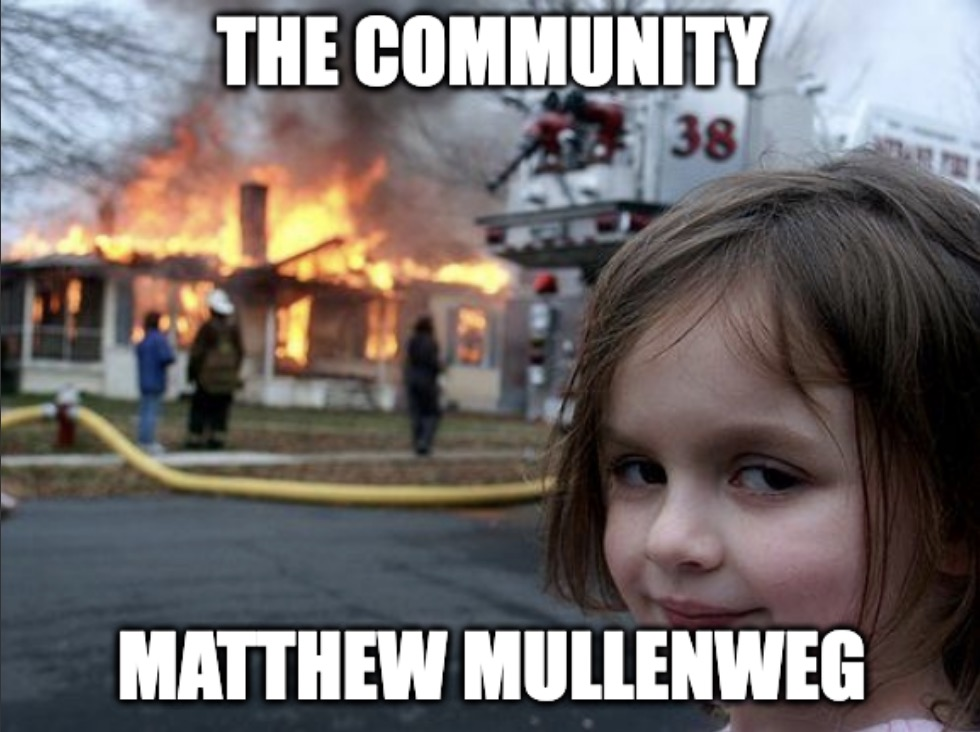

# WordPlay - Putting the FUN in dysFUNctional 🎉

**WordPlay** is a simple, fun and free WordPress® plugin that lets you display a random WordPress® meme from a set of 14 preloaded images. 

Whether on the front-end using widgets or shortcodes, or on the dashboard with a custom widget, WordPlay brings a little randomness and joy to your website that just so happens to be powered by WordPress®.

## Features 🚀

1. **Dashboard Widget**: A custom dashboard widget that displays a random meme in the WordPress® admin area.
2. **Frontend Widget**: A sidebar widget that users can add to any widgetized area of their website to show a random meme.
3. **Shortcode**: A shortcode `[wordplay]` that displays a random meme anywhere within posts or pages.

## Plugin Slogan 🏷️

**"Putting the FUN in dysFUNctional"**

## Example 📸

* * *

## Table of Contents 📚

- [Installation](#installation)
- [Usage](#usage)
- [Customization](#customization)
- [FAQ](#faq)
- [Contributing](#contributing)
- [License](#license)
* * *

## Installation 💻

### From WordPress® Admin:

1. Download the `WordPlay` plugin from the [GitHub repository](https://github.com/robertdevore/wordplay).
2. In your WordPress® Admin Dashboard, navigate to **Plugins > Add New**.
3. Click **Upload Plugin**, then select the `WordPlay.zip` file you downloaded.
4. Click **Install Now**, then activate the plugin after installation.

### Manually:

1. Download the plugin from the [GitHub repository](https://github.com/robertdevore/wordplay).
2. Unzip the file and upload the `wordplay` folder to the `/wp-content/plugins/` directory.
3. Activate the plugin in the **Plugins** menu within the WordPress® Admin Dashboard.
* * *

## Usage 🎨

### 1. **Dashboard Widget**

- After activating the plugin, navigate to your WordPress® admin dashboard.
- You'll see a new widget titled **WordPlay Random Image** on your dashboard, displaying a random meme from the plugin.

### 2. **Frontend Widget**

- Go to **Appearance > Widgets** in your WordPress® admin area.
- Drag the **WordPlay** widget to any widget area (e.g., Sidebar or Footer).
- The widget will display a random meme from the plugin's image folder on the frontend.

### 3. **Shortcode**

- Use the shortcode `[wordplay]` to display a random meme in any page or post.
- Example usage:

    [wordplay]

- You can add this shortcode anywhere in the editor, and it will output a random meme.
* * *

## Customization ✏️

Currently, the plugin comes with a set of 14 memes preloaded in the `public/assets/img/` folder. You can replace these images with your own to customize the memes displayed by the plugin. Just make sure they use one of the supported formats (`.jpg`, `.jpeg`, `.png`, `.gif`, `.webp`).

### Changing Images:

1. Navigate to the folder: `public/assets/img/`.
2. Replace the images with your own, maintaining the existing image names if possible.

* * *

## FAQ ❓

### 1. How can I add more memes to the plugin?

- You can add more images to the `public/assets/img/` folder. The plugin will automatically detect and include them in the random image rotation.

### 2. Does the plugin support different image formats?

- Yes! The plugin supports `.jpg`, `.jpeg`, `.png`, `.gif`, and `.webp` formats.

### 3. Can I use the shortcode inside widgets?

- Yes, simply enable the **Shortcode in Widgets** option by adding the following code to your theme's `functions.php`:

    add_filter('widget_text', 'do_shortcode');

* * *

## Contributing 🤝

We welcome contributions to enhance this plugin! Here's how you can contribute:

1. **Fork** the repository on GitHub.
2. **Clone** your fork locally:

    git clone https://github.com/yourusername/wordplay.git

3. Create a new **branch** for your feature or bug fix:

    git checkout -b feature-name

4. **Commit** your changes:

    git commit -m "Add a meaningful commit message"

5. **Push** your changes to your fork:

    git push origin feature-name

6. Open a **Pull Request** to the `main` branch of the original repository.
* * *

## License 📜

This project is licensed under the GPLv2 License. See the LICENSE file for details.

* * *

## Author 👤

**[Robert DeVore](https://github.com/robertdevore)**
WordPlay - Bringing random joy to WordPress® sites, one meme at a time 🤘